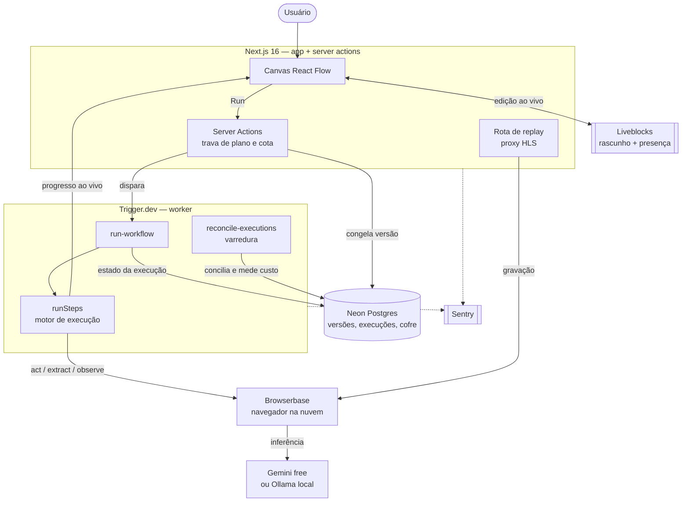

# Switchboard

> Editor visual de automações de navegador — canvas colaborativo, multi-tenant, executado em navegadores hospedados na nuvem, com replay em vídeo de cada execução.


## Sobre o projeto

**Switchboard** é uma aplicação **Next.js 16 (App Router)** onde montar uma automação de navegador é desenhar, não programar: você liga nós num canvas infinito — abrir página, agir, extrair dados, delegar um objetivo a um agente de IA, mandar e-mail — e clica em **Run**.

A execução acontece num navegador real na nuvem, fora do request HTTP, e o progresso de cada etapa volta para a tela enquanto ainda está acontecendo. O canvas é compartilhado: a organização inteira edita o mesmo fluxo ao mesmo tempo.

O projeto é **pessoal e de estudo**, e o que ele tenta demonstrar não é a quantidade de features, mas o processo: decisões registradas em [13 ADRs](docs/adr/), lógica pura testada em TDD, portões de CI que barram código morto e schema fora de sincronia, um [postmortem](docs/postmortems/) escrito a partir de um defeito real, e um [roadmap](docs/roadmap.md) que distingue *resolvido*, *aceito* e *sei que existe*.

## Principais funcionalidades

- **Canvas colaborativo** — React Flow sobre uma sala do [Liveblocks](https://liveblocks.io): cursores, presença e edição simultânea, sem botão de salvar.
- **Ações de IA no navegador** — `act`, `extract`, `observe` e `agent` do [Stagehand](https://docs.stagehand.dev) contra páginas reais em navegadores da [Browserbase](https://browserbase.com).
- **Execução durável** — cada run é uma task do [Trigger.dev](https://trigger.dev), solta da aba: fechar o navegador não cancela nada.
- **Versões imutáveis** — o rascunho vive no Liveblocks; ao rodar, o grafo é congelado como versão no Postgres, o que elimina a corrida entre salvar e executar.
- **Interpolação entre nós** — qualquer campo puxa o resultado de um nó anterior com `{{ nodeId.path }}`, resolvido na execução.
- **Acompanhamento ao vivo** — estado, duração e saída de cada etapa chegam ao canvas durante a run.
- **Replay em vídeo** — a gravação da sessão, servida em HLS por um proxy próprio (a chave secreta nunca chega ao cliente).
- **Disparo por agendamento e por webhook** — cron com fuso, e `POST` com assinatura HMAC no formato Stripe, limite de frequência e idempotência.
- **Multi-tenancy real** — Clerk Organizations, com o isolamento por organização garantido na camada de dados, não na interface.
- **Cotas e planos** — limite mensal de execuções por organização, conferido no servidor dentro da trava de run.
- **Observabilidade** — Sentry no app e dentro do worker, com redação de segredos antes de qualquer gravação.

## Tech Stack

| Camada | Tecnologia |
| --- | --- |
| Framework | Next.js 16 (App Router), React 19 |
| Linguagem | TypeScript 5 |
| UI | Tailwind CSS 4, shadcn/ui, Radix UI, React Flow (`@xyflow/react`) |
| Colaboração | Liveblocks (rascunho do grafo, presença) |
| Banco de dados | Neon Postgres + Drizzle ORM (migrations versionadas) |
| Execução assíncrona | Trigger.dev v4 (tasks, agendamentos, realtime) |
| Automação de navegador | Browserbase + Stagehand v3 |
| Modelos | Google Gemini (free tier) · Ollama local — sem provedor pago |
| Autenticação e billing | Clerk (Organizations, Billing) |
| E-mail | Resend |
| Observabilidade | Sentry (app, edge e worker) |
| Testes | Vitest (unidade) · Playwright + Clerk testing (E2E) |

## Arquitetura



**O caminho de uma execução:**

1. O grafo é editado no canvas e vive numa sala do **Liveblocks** — sem salvar explícito.
2. No **Run**, uma server action confere plano e cota, e **congela o grafo como versão imutável** no Postgres. A task lê a versão, não o rascunho ([ADR 0002](docs/adr/0002-versoes-imutaveis-de-workflow.md)).
3. A run vira uma **task do Trigger.dev**, com fila e concorrência por organização ([ADR 0006](docs/adr/0006-concorrencia-por-org.md)) e no máximo uma run viva por workflow, garantida por trava no Postgres.
4. O motor (`runSteps`) percorre os nós em ordem topológica, atrás de duas interfaces — navegador e progresso — que é o que o torna testável com dublês ([ADR 0004](docs/adr/0004-motor-de-execucao.md)).
5. **Uma run, um navegador:** a sessão da Browserbase abre no primeiro nó que precisa dela e é liberada uma única vez, na saída ou no cancelamento, para a gravação cobrir o fluxo inteiro.
6. O progresso sobe por metadata da run e chega ao canvas em tempo real; o estado final é gravado na tabela `executions`, protegido por máquina de estados ([ADR 0003](docs/adr/0003-registro-de-execucoes.md)).
7. Uma **varredura periódica** concilia execuções que travaram sem acionar hook e coleta a duração de sessão para o custo ([ADR 0013](docs/adr/0013-medicao-de-custo-por-execucao.md)).

## Decisões de engenharia

As decisões ficam em [`docs/adr/`](docs/adr/), cada uma com o contexto, as alternativas recusadas e as consequências. Algumas que moldam o código:

| ADR | Decisão |
| --- | --- |
| [0002](docs/adr/0002-versoes-imutaveis-de-workflow.md) | Versões imutáveis de workflow — fecha a corrida entre salvar e executar |
| [0003](docs/adr/0003-registro-de-execucoes.md) | Registro de execuções com transições guardadas no próprio `upsert` |
| [0004](docs/adr/0004-motor-de-execucao.md) | Motor extraído da task, atrás de portas, testado com dublês |
| [0007](docs/adr/0007-retry-por-passo.md) | Nova tentativa por passo, só para erro passageiro e só em nó idempotente |
| [0009](docs/adr/0009-trigger-por-webhook.md) | Assinatura HMAC no formato Stripe, janela de 5 min, comparação em tempo constante |
| [0011](docs/adr/0011-cofre-de-credenciais.md) | Cofre com envelope: chave de dados por segredo, embrulhada por chave-mestra |
| [0012](docs/adr/0012-redacao-de-erros.md) | Redação de segredos antes de gravar erro em banco, tela ou Sentry |
| [0013](docs/adr/0013-medicao-de-custo-por-execucao.md) | Custo medido em quantidades, nunca em dinheiro gravado |

## Estrutura do projeto

```
nextjs-switchboard/
├── app/                      # Rotas (App Router), API e webhooks
├── features/
│   └── workflows/
│       ├── components/       # Canvas, inspector, painéis
│       ├── engine/           # runSteps — motor, sem saber o que é Stagehand
│       ├── lib/              # Regras puras e testáveis (sem I/O)
│       ├── nodes/            # Um arquivo por nó + registry + políticas
│       ├── tasks/            # Tasks do Trigger.dev
│       └── data.ts           # Única camada que conhece Drizzle
├── lib/
│   ├── db/                   # Schema e cliente Postgres
│   ├── vault.ts              # Selo de credenciais
│   └── redact.ts             # Redação de segredos
├── drizzle/                  # Migrations versionadas
├── docs/
│   ├── adr/                  # 13 registros de decisão
│   ├── postmortems/          # Análise de defeito real
│   └── roadmap.md            # Estado por fase e achados
├── e2e/                      # Playwright + Clerk testing
└── trigger.config.ts
```

Três regras sustentam o desenho: **regra pura vai para `lib/` com o teste ao lado**; **persistência só em `data.ts`**, que é também o único ponto onde o cofre abre; e **nada de indireção com um implementador só** — o seam de teste é o módulo.

### Para acrescentar um nó

Quatro edições em `features/workflows/nodes/`: o arquivo do executor, o registro em `node-executors.ts`, a entrada no `node-registry.ts` e a política em `step-policies.ts`. O `satisfies` transforma um executor faltando em erro de compilação. A task e o componente do canvas são dirigidos pelo registry — não se toca neles.

## Qualidade

- **543 testes** em 41 arquivos (Vitest), com TDD na lógica pura: máquinas de estado, validação de grafo, cotas, assinatura de webhook, métricas e custo.
- **E2E** com Playwright e login programático pelo Clerk, rodando contra o deploy de preview a cada PR.
- **CI** ([ADR 0001](docs/adr/0001-pipeline-de-ci.md)) barra: lint, typecheck, testes, build de produção, formatação, código morto (knip), migration fora de sincronia com o schema e advisory crítica em dependência de produção.
- **Dependabot** com grupos e período de espera para versões recém-publicadas.

## Scripts disponíveis

| Comando | Descrição |
| --- | --- |
| `npm run dev` | Servidor de desenvolvimento |
| `npm run build` | Build de produção |
| `npm run trigger:dev` | Worker do Trigger.dev em desenvolvimento |
| `npm test` | Suíte Vitest |
| `npm run e2e` | Suíte Playwright |
| `npm run typecheck` | `tsc --noEmit` |
| `npm run lint` | ESLint |
| `npm run knip` | Detecta código e dependências sem uso |
| `npm run db:generate` | Gera migration a partir do schema |
| `npm run db:migrate` | Aplica migrations |

## Configuração

Copie `.env.example` e preencha. O arquivo documenta cada variável, quem a lê (app ou worker) e quais são obrigatórias.

Sobre modelos: o projeto roda **apenas em camada gratuita**. `STAGEHAND_MODEL` aceita `google/*` (Gemini free) e `ollama/*` (local, só com `trigger dev`); qualquer outro provedor é recusado pelo nome antes de abrir sessão, para que uma variável esquecida não comece a gastar.

## Limitações conhecidas

O [roadmap](docs/roadmap.md) mantém a lista completa com gravidade e destino. As que mais afetam quem for rodar:

- O nó **Agent** é frágil com modelos gratuitos — em horário de pico o modelo fica sobrecarregado e o passo estoura o limite de 3 minutos.
- A cota gratuita da Browserbase (1 hora de navegador por mês) é o **teto real da plataforma**, compartilhado entre desenvolvimento e produção.
- O worker do Trigger.dev **não é publicado por nenhum workflow** — mudança em task exige `trigger:deploy` manual.
- Os agendamentos estão **desligados** enquanto o projeto está ocioso; religar é devolver a linha do `cron` e publicar.
