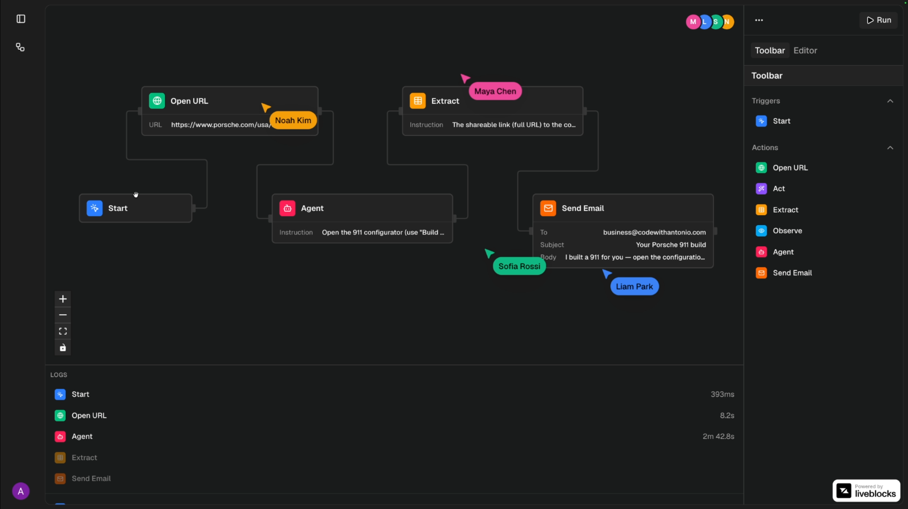
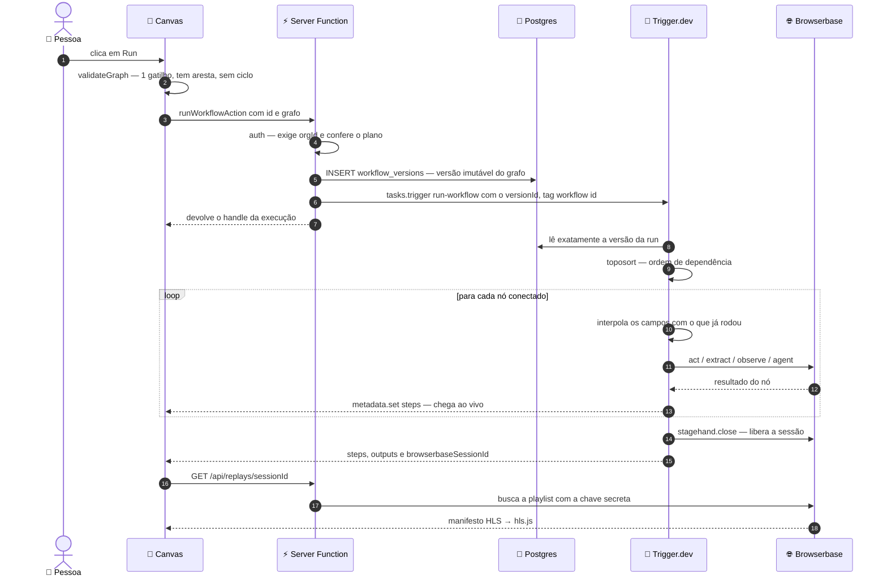
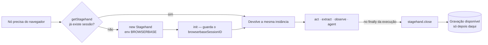
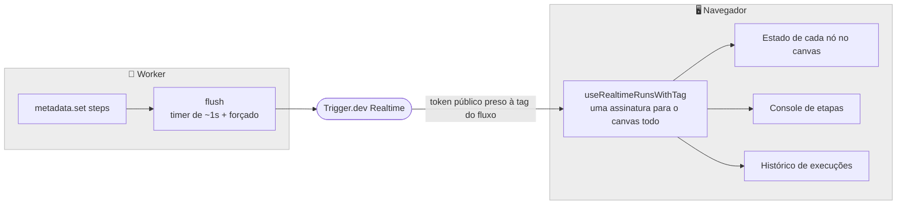
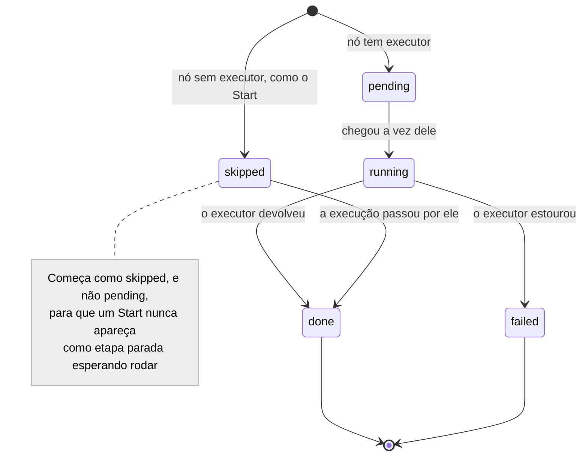
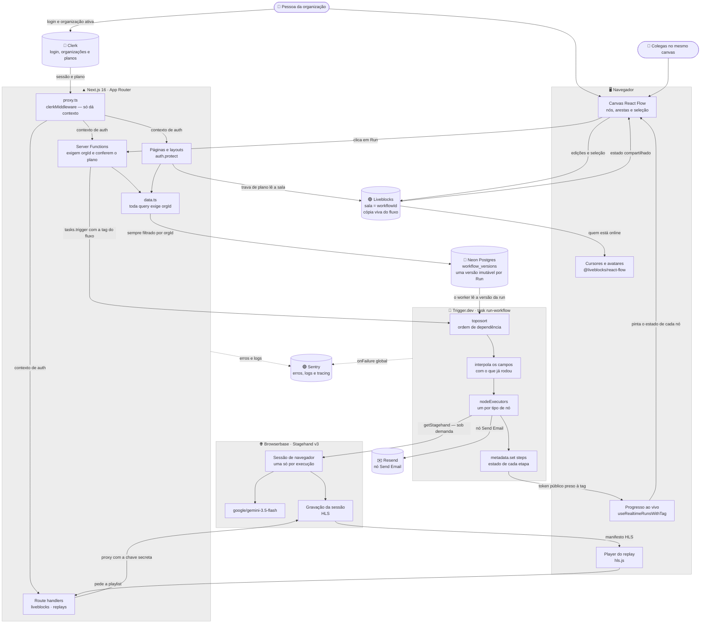
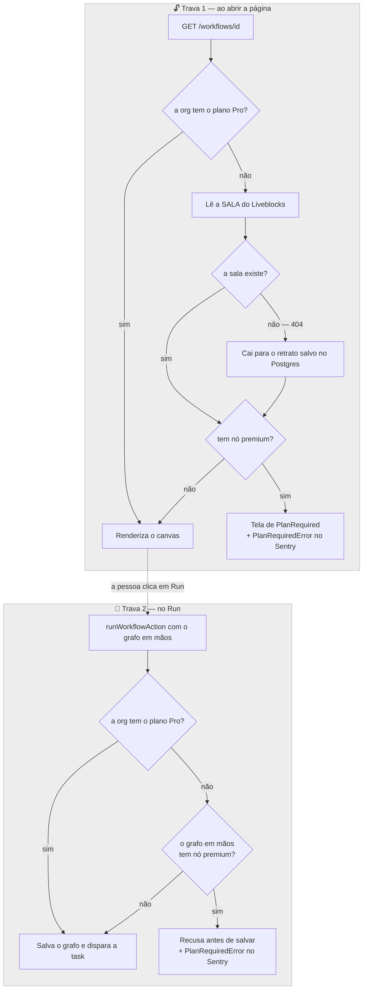

<div align="center">

# Switchboard

**Conecte os nós. Execute na nuvem. Faça o replay de cada execução.**

Editor visual de automações de navegador — colaborativo, multi-tenant
e executado em navegadores hospedados na nuvem.

[](https://browserbase.com)
[](https://docs.stagehand.dev)
[](https://trigger.dev)
[](https://liveblocks.io)
[](https://neon.com)
[](https://clerk.com)
[](https://sentry.io)
[](https://nextjs.org)

</div>



Aqui, montar uma automação de navegador é desenhar em vez de programar. Você arrasta nós para um
canvas infinito — abrir uma página, clicar em algo, extrair dados, entregar um objetivo inteiro a um
agente de IA, mandar o resultado por e-mail —, liga um no outro e clica em **Run**. A execução
acontece num navegador de verdade rodando na nuvem, o progresso de cada etapa volta para a tela
enquanto ainda está acontecendo, e no fim sobra um vídeo de tudo o que o navegador fez.

O canvas é compartilhado: todo mundo da organização mexe no mesmo fluxo ao mesmo tempo, com cursores
e presença ao vivo — a mesma sensação de estar num arquivo do Figma.

**Atalhos** · [O que faz](#-o-que-faz) · [Os nós](#-os-nós) · [Como funciona](#-como-funciona) ·
[Arquitetura](#-arquitetura) · [Estrutura](#-estrutura-do-projeto) ·
[Stack](#-stack-completa) · [Decisões de engenharia](#-decisões-de-engenharia)

---

## ✨ O que faz

| | |
| --- | --- |
| **Canvas visual** | Editor de nós infinito sobre React Flow, com painéis que você arrasta para redimensionar, uma toolbar para inserir nós e um inspector para editar o que está selecionado. |
| **Edição a várias mãos** | O fluxo inteiro mora numa sala do Liveblocks. Cursores, avatares e edições simultâneas — sem conflito e sem botão de salvar. |
| **Ações de IA no navegador** | `act`, `extract`, `observe` e `agent` do Stagehand, rodando contra páginas reais em navegadores na nuvem da Browserbase. |
| **Nós que conversam entre si** | Qualquer campo pode puxar o resultado de um nó anterior com `{{ nodeId.path }}`, resolvido na hora da execução. |
| **Execução que não morre com a aba** | Cada run é uma task do Trigger.dev, solta do request HTTP. Fechar o navegador não cancela nada. |
| **Acompanhamento ao vivo** | O estado de cada etapa (`pending → running → done / failed`), quanto tempo levou e o que devolveu chegam ao canvas durante a execução. |
| **Replay em vídeo** | A gravação da sessão do navegador, servida em HLS por um proxy próprio. |
| **Uma organização, um espaço** | Multi-tenancy de verdade via Clerk Organizations, com o isolamento garantido na camada de dados. |
| **Base de SaaS pronta** | Planos, checkout e permissões com Clerk Billing. Nós premium travados no servidor, não só na interface. |
| **Observabilidade ponta a ponta** | Sentry no app e dentro do worker de tasks, com source maps dos dois lados. |

---

## 🛠️ Stack completa

| Camada | Tecnologia |
| --- | --- |
| **Framework** | Next.js `16.2.6` (App Router, Turbopack), React `19.2.4`, TypeScript `^5` |
| **Canvas de workflow** | React Flow — `@xyflow/react` `^12.11.6` |
| **Colaboração em tempo real** | Liveblocks `^3.24.1` — `react-flow`, `react`, `react-ui`, `node` |
| **Camada de API** | Server Functions (`"use server"`) e Route Handlers nativos do Next |
| **Jobs em background** | Trigger.dev `4.5.16` — execução durável + realtime · runtime `node-24` |
| **Automação de navegador** | Browserbase `@browserbasehq/sdk` `^2.19.1` + Stagehand `^3.6.0` |
| **Integração de IA** | `google/gemini-3.5-flash`, roteado pelo Stagehand — `act` · `extract` · `observe` · `agent` |
| **Banco de dados** | Neon Postgres + Drizzle ORM `^0.45.2` (`drizzle-kit` `^0.31.10`, driver `pg` `^8.23.0`) |
| **Auth** | Clerk `^7.9.1` — Organizations, multi-tenancy, session tasks |
| **Billing** | Clerk Billing — `@clerk/ui` `^1.32.2`, `PricingTable` e checkout in-app |
| **E-mail** | Resend `^6.26.0` |
| **Replay em vídeo** | Browserbase Session Replay + `hls.js` `^1.7.2` |
| **Error tracking** | Sentry `^10.73.0` — app, edge e worker, com source maps dos dois lados |
| **Estilo / UI** | Tailwind CSS `^4`, Radix UI `^1.6.7`, shadcn/ui `^4.20.1` |


> No Next.js 16 o *Middleware* virou **Proxy** — daí o `proxy.ts` na raiz no lugar do
> `middleware.ts`. O comportamento é o mesmo.

> O Neon entra com duas connection strings: a `DATABASE_URL` (com pool, via PgBouncer) para a
> aplicação e a `DATABASE_URL_UNPOOLED` (direta) para as migrations. O PgBouncer trabalha em modo
> transação e não aguenta operação de sessão.

---

## 🧩 Os nós

| Nó | Tipo | O que faz | Devolve |
| --- | --- | --- | --- |
| **Start** | gatilho | Ponto de partida. Não executa nada — só marca onde o fluxo começa | — |
| **Open URL** | ação | Leva a sessão até uma URL | `url`, `title` |
| **Act** | ação | Executa **uma** ação guiada por IA ("clique no botão de login") | `success`, `message`, `url` |
| **Extract** | ação | Tira dados estruturados da página a partir de uma instrução escrita em linguagem comum | `extraction` |
| **Observe** | ação | Acha os elementos candidatos **sem** mexer neles | `matches` |
| **Agent** 💎 | ação | Recebe um objetivo inteiro e se vira sozinho, em quantas etapas precisar | `success`, `message`, `completed` |
| **Send Email** | ação | Manda o resultado por e-mail. É o único que não encosta no navegador | `id` |

> 💎 **Só no plano Pro.** O Agent roda um ciclo completo de *computer use* — várias chamadas ao
> modelo por etapa, o que faz dele de longe o nó mais caro de executar.

O catálogo é **definido por manifesto**: o `node-registry.ts` declara rótulo, ícone, cor, campos de
entrada e saídas de cada tipo. Tanto a task que executa quanto o componente do canvas leem esse
registro — nenhum dos dois sabe da existência de um nó específico.

---

## ⚙️ Como funciona

### O caminho de uma execução



### Em que ordem os nós rodam

Os nós são executados em **ordem topológica** (`toposort`). Entram na fila só os que **encostam em
alguma aresta** — nós soltos, largados num canto do canvas, ficam de fora. Um ciclo é barrado antes
de qualquer coisa começar, tanto na conferência do cliente quanto na do servidor, porque o
`toposort` estoura ao encontrar um.

O **Start** é o único nó que nunca executa: ele não tem executor, então a execução só o marca como
concluído ao passar por ele.

### Uma execução, um navegador só

A run abre **uma única sessão na Browserbase, e só quando precisa**: no primeiro nó que realmente
exige um navegador. Todos os nós seguintes reaproveitam a mesma. É isso que faz a gravação cobrir o
fluxo inteiro em vez de virar um vídeo picado por etapa — e é por isso que um fluxo feito só de
`Send Email` **não abre navegador nenhum**.



O `sessionId` é guardado no instante em que a sessão abre, mas só sai no **retorno final da run** —
não no metadata. A gravação só pode ser buscada depois que a sessão fecha, o que acontece no
`finally` do percurso. Ou seja: o primeiro momento em que esse id serve para alguma coisa é o
resultado final.

### Como um nó usa o resultado do outro

Qualquer campo de qualquer nó pode aproveitar o que veio antes:

```
https://exemplo.com/busca?q={{ n1.extraction.query }}
```

O primeiro pedaço é o **id do nó**; o resto é o caminho dentro do que aquele nó devolveu —
`{{ n1.items[0].name }}` também funciona. O que não resolve vira **texto vazio**, e não um
`undefined` escrito por extenso: dentro de uma URL ou de um prompt, um espaço em branco incomoda
menos do que a palavra errada.

Como os nós já rodam em ordem de dependência, tudo o que um nó aponta já foi calculado. O inspector
monta a lista de tokens disponíveis subindo o grafo **a partir do nó selecionado** — não só os pais
diretos —, lendo o estado vivo do React Flow. A lista se refaz sozinha conforme você liga e desliga
arestas.

### Do worker até a tela, ao vivo

O progresso viaja pelo **metadata da run** do Trigger.dev. O navegador se inscreve com um token
público de leitura limitado à tag `workflow:<id>`, emitido no servidor, válido por 1 hora e incapaz
de enxergar qualquer outra coisa.



O ciclo de vida de uma etapa, do jeito que o canvas pinta:



O canvas inteiro compartilha **uma assinatura só**, guardada num provider — nenhum componente abre
conexão por conta própria.

Dois detalhes sustentam esse fluxo:

- **O array de etapas é refeito a cada mudança, nunca alterado no lugar.** O `metadata.set` guarda a
  referência que recebe e ignora a chamada seguinte se o valor novo for idêntico ao que ele já tem.
  Editar uma etapa direto no array editaria também a cópia guardada — os dois lados sempre bateriam,
  e toda atualização depois da primeira seria descartada em silêncio.
- **No caminho de erro, o flush insiste.** O `metadata.flush()` volta sem fazer nada se já houver um
  flush em andamento, e a run estoura logo em seguida. Sem insistir além dessa janela, a etapa que
  falhou nunca sairia do worker.

### O replay da sessão

Buscar a playlist HLS exige a **chave secreta** da Browserbase, então isso não pode acontecer no
navegador. Mas só o manifesto passa pelo proxy: os endereços dos segmentos dentro dele são links de
CDN já assinados, que o player busca direto.

Essas assinaturas valem cerca de 6 horas, e é justamente por isso que **nada ali pode ser cacheado**
— um manifesto cacheado é um manifesto cheio de link morto. Pedir de novo é o que gera assinaturas
novas.

Enquanto a gravação está sendo montada, a Browserbase responde `404`. O painel então fica
perguntando (a cada 3s, desistindo em 180s) e a rota devolve `202 pending` nesse meio-tempo. O
limite de tempo não é frescura: uma sessão em processamento e uma sessão que nunca vai ter gravação
respondem exatamente o mesmo `404` — nada abaixo consegue distinguir as duas.

---

## 🏗️ Arquitetura

### Visão geral



### Duas cópias do fluxo, de propósito

| Cópia | Onde mora | Quando é escrita | Quem lê |
| --- | --- | --- | --- |
| **Viva** | sala do Liveblocks | a cada tecla, por todo mundo junto | o canvas e a trava de plano |
| **Versão** | tabela `workflow_versions`, uma linha imutável por Run | no clique em **Run** | o worker do Trigger.dev, pelo `versionId` da run |

O worker não tem conexão com a sala — é para isso que a versão existe. E ela é imutável: se alguém
rodar de novo enquanto uma run ainda está na fila, cada uma executa o grafo com que foi iniciada
([ADR 0002](docs/adr/0002-versoes-imutaveis-de-workflow.md)). Já a trava de plano lê a
**sala**, e não o retrato: um fluxo montado no Pro e nunca executado tem o nó Agent na sala e nada
no Postgres.

### Modelo de dados

```sql
workflows
  id          uuid        pk, default random
  org_id      text        not null      -- organização do Clerk
  name        text        not null
  graph       jsonb                     -- { nodes, edges } no formato do React Flow
  created_at  timestamp   not null
  updated_at  timestamp   not null

workflow_versions                        -- uma por Run, nunca alterada
  id           uuid       pk, default random
  workflow_id  uuid       fk → workflows, on delete cascade
  org_id       text       not null
  graph        jsonb      not null
  created_at   timestamp  not null
```

O `graph` espelha o formato do React Flow **1:1**, então o executor lê o fluxo sem precisar converter
nada. O tipo `WorkflowGraph` sai do schema do Drizzle — nunca é escrito na mão.

### Multi-tenancy e autenticação

**O isolamento é estrutural.** Todas as funções de `features/workflows/data.ts` recebem `orgId` como
**argumento obrigatório**. Não dá para escrever uma query fora do escopo de uma organização — isso
não passa da compilação, não é algo que dependa de alguém lembrar no code review.

**A autenticação fica no recurso, não no proxy.** O `proxy.ts` roda `clerkMiddleware()` e mais nada.
Cada superfície protegida se vira sozinha:

| Superfície | Como se protege | O que responde a quem não está logado |
| --- | --- | --- |
| Páginas e layouts | `auth.protect()` | redireciona para `/sign-in` |
| Route handlers | checagem explícita de `userId` / `orgId` | `401` |
| Server Functions | exigem `orgId` antes de tocar em dado | erro |
| Camada de dados | `orgId` é parâmetro | nem compila |

Trava por caminho no middleware pode não bater com o jeito que o Next.js realmente resolve a
requisição, e Server Functions são chamadas por **id**, não por rota. Por isso a proteção pertence ao
recurso, e não ao caminho até ele.

Sessões **pendentes** — as que ainda devem uma etapa de login, como escolher a organização — contam
como deslogadas para o `auth.protect()`. É por isso que `/choose-organization` fica fora do grupo
protegido: protegê-la jogaria a pessoa de volta para o `/sign-in`, que a mandaria de volta para lá.

### A trava de plano roda no servidor, duas vezes

A toolbar tranca o nó Agent para quem está no plano gratuito, mas isso é só aparência. As travas de
verdade são estas:



A primeira trava lê a **sala**, e não o retrato salvo, porque um fluxo montado no Pro e nunca
executado só existe na sala. Um `404` da sala cai para o grafo salvo; qualquer outro erro sobe —
engolir o erro seria lido como "não tem nó premium" e liberaria o acesso.

A segunda confere o grafo **que está na mão**, antes de salvar: o canvas é compartilhado, então
alguém pode ter posto o nó agora. É a última chance de barrar, porque a task roda sem sessão do
Clerk e lá não existe `has()` para perguntar.

Uma recusa levanta um `PlanRequiredError` com nome próprio, para não se misturar com falhas de
verdade no Sentry e para o relatório dizer qual plano resolveria.

### Observabilidade

| Onde | Como chega no Sentry |
| --- | --- |
| Navegador | `instrumentation-client.ts`, com túnel em `/monitoring` para escapar de bloqueador de anúncio |
| Servidor / Edge | `instrumentation.ts` + `onRequestError` |
| Worker de tasks | `features/init.ts` — gancho global `tasks.onFailure` |
| Source maps | plugin no `next.config.ts` (app) e `esbuildPlugin` no `trigger.config.ts` (worker) |

O worker precisa da própria inicialização porque **as tasks rodam fora do Next**: nenhum dos arquivos
`sentry.*.config.ts` chega até elas. O `onFailure` global só dispara depois que as retentativas
acabam, então uma run que falha duas vezes e passa na terceira não abre três issues.

O contexto de cada requisição usa **isolation scope**, e não o escopo global: duas organizações podem
estar renderizando ao mesmo tempo no mesmo servidor, e os dados de uma não podem vazar no log da
outra.

---

## 📁 Estrutura do projeto

Quatro territórios, com fronteiras firmes entre eles:

| Pasta | Responsabilidade |
| --- | --- |
| **`app/`** | Roteia e protege. Nenhuma regra de negócio mora aqui. |
| **`features/`** | O produto: o fluxo, seus nós e a task que os executa. |
| **`lib/`** | Schema do banco e os clientes dos serviços externos. |
| **raiz** | Configuração de build, runtime e observabilidade. |

### `app/` — rotas

```
app/
├── (auth)/                            fora do grupo protegido
│   ├── sign-in/
│   ├── sign-up/
│   └── choose-organization/           session task do Clerk
│
├── (dashboard)/
│   ├── layout.tsx                     auth.protect() + sidebar com os fluxos
│   ├── page.tsx                       estado vazio
│   ├── billing/                       PricingTable do Clerk
│   └── workflows/[id]/                o canvas — trava de plano, sala e token
│
└── api/
    ├── liveblocks/auth/               identifyUser com groupIds = [orgId]
    ├── liveblocks/users/              nome e avatar, só da org de quem pediu
    └── replays/[sessionId]/           proxy do HLS (chave secreta, no-store)
```

### `features/` — o produto

```
features/
├── init.ts                            ciclo de vida do worker (Sentry)
│
└── workflows/
    ├── actions.ts                     criar · apagar · rodar · cancelar
    ├── data.ts                        queries do Drizzle, todas com orgId
    │
    ├── nodes/                    ◄──  o catálogo: quem manda no resto
    │   ├── node-registry.ts           manifesto: campos, saídas, ícone, premium
    │   ├── node-executors.ts          mapa tipo → executor
    │   ├── open-url.ts
    │   ├── act.ts
    │   ├── extract.ts
    │   ├── observe.ts
    │   ├── agent.ts                   o único nó premium
    │   └── send-email.ts              o único que não abre navegador
    │
    ├── tasks/
    │   └── run-workflow.ts            a task do Trigger.dev
    │
    ├── lib/
    │   ├── interpolate.ts             resolve os tokens de um nó para o outro
    │   ├── validate-graph.ts          1 gatilho, tem aresta, sem ciclo
    │   └── premium-gate.ts            nós premium na sala / no fluxo salvo
    │
    ├── hooks/
    │   ├── use-upstream-connections.ts   tokens disponíveis para o nó atual
    │   └── use-pro-plan.ts               permissão no cliente (só aparência)
    │
    └── components/
        ├── canvas.tsx                 React Flow + Liveblocks
        ├── step-node.tsx              nó genérico, montado pelo registro
        ├── right-sidebar.tsx          abas Toolbar e Editor
        ├── console-panel.tsx          o que cada etapa devolveu
        ├── logs-panel.tsx             linha do tempo, com duração
        ├── session-replay.tsx         player HLS com polling
        ├── workflow-runs-provider.tsx a assinatura de tempo real, uma só
        └── room.tsx                   LiveblocksProvider + RoomProvider
```

### `lib/` — schema e clientes

```
lib/
├── billing.ts                         PRO_PLAN + PlanRequiredError
├── db/
│   ├── schema.ts                      tabela workflows + WorkflowGraph
│   └── index.ts                       Drizzle, com o pool no globalThis
├── browserbase.ts                     SDK principal (só servidor)
├── liveblocks.ts                      cliente de servidor (sob demanda)
├── resend.ts                          cliente de e-mail (só servidor)
└── utils.ts                           cn() e afins
```

### Raiz — configuração

```
proxy.ts                               clerkMiddleware() e mais nada
trigger.config.ts                      node-24, Stagehand external, source maps
next.config.ts                         Sentry, túnel em /monitoring
drizzle.config.ts                      aponta para a DATABASE_URL_UNPOOLED
neon.ts                                política de branches (TTL de 7d)
liveblocks.config.ts                   tipos globais da sala
instrumentation.ts                     Sentry no servidor e na edge
instrumentation-client.ts              Sentry no navegador
sentry.server.config.ts                inicialização do servidor
sentry.edge.config.ts                  inicialização da edge
drizzle/                               migrations SQL versionadas
```

### Para acrescentar um nó

Três arquivos, todos em `features/workflows/nodes/`:

| # | Arquivo | O que fazer |
| --- | --- | --- |
| 1 | `<nome>.ts` | Escrever a lógica do executor |
| 2 | `node-executors.ts` | Registrar o nó — o contrato `satisfies` transforma um executor esquecido em **erro de compilação** quando o nó é de ação |
| 3 | `node-registry.ts` | Declarar tipo, rótulo, ícone, cor, os `fields` de entrada e os `outputs` que os nós seguintes vão poder referenciar. `premium: true` o tranca no plano Pro |

A task de execução e o componente do canvas se viram sozinhos a partir do registro — **não encoste
neles para adicionar um nó.**

---

### Bibliotecas de apoio

| Papel | Pacote |
| --- | --- |
| Ordem topológica do grafo | `toposort` `^2.0.2` |
| `get` por caminho, na interpolação | `es-toolkit` `^1.52.0` |
| Painéis redimensionáveis | `react-resizable-panels` `^4.12.3` |
| Ícones, inclusive os do registro de nós | `lucide-react` `^1.40.0` |
| Tema claro/escuro, repassado ao React Flow | `next-themes` `^0.4.6` |
| Avisos (toasts) | `sonner` `^2.0.8` |
| Fecha conexão ociosa no Vercel Fluid | `@vercel/functions` `^3.9.5` |
| Política de branches do Neon | `@neon/config` `^1.3.0` · `@neon/env` `^1.2.1` |
| Durações | `pretty-ms` `^9.3.1` |
| Nomes de fluxo gerados | `unique-names-generator` `^4.7.1` |
| Composição de classes e animações | `clsx` · `tailwind-merge` · `class-variance-authority` · `tw-animate-css` |
| Tooling | ESLint `^9` + `eslint-config-next` · Prettier `^3.8.3` + plugin Tailwind · Vitest `^5` · `tsx` · `dotenv` |

### O que deliberadamente não está aqui

- **Sem tRPC ou TanStack Query.** A conversa cliente→servidor é Server Function, e o estado que
  precisaria de cache reativo — o grafo — já vive na sala do Liveblocks. O único dado que chega de
  fora é o progresso da execução, e ele vem por socket do Trigger.dev, não por query.
- **Sem gerenciador de estado global.** Zustand ou Redux não teriam o que guardar: o grafo é do
  Liveblocks, a seleção é do React Flow e o progresso é do provider de execuções.
- **Sem SDK de IA no app.** As chamadas ao modelo acontecem dentro do Stagehand, que já resolve o
  roteamento de provider. O código do projeto nunca fala com um LLM diretamente.

### Scripts

| Script | O que faz |
| --- | --- |
| `dev` · `build` · `start` | O ciclo do Next.js |
| `trigger:dev` · `trigger:deploy` | CLI do Trigger.dev, na mesma versão do SDK: sobe o worker local ou publica as tasks |
| `lint` · `typecheck` | ESLint · `tsc --noEmit` |
| `format` · `format:check` | Prettier: formata os arquivos, ou só confere (é o que o CI roda) |
| `test` · `test:watch` | Vitest: uma rodada só, ou refazendo a cada alteração |
| `knip` | Knip: arquivos, dependências e exports sem uso (também roda no CI) |
| `db:generate` · `db:migrate` · `db:studio` | Drizzle Kit. O schema só muda por migration: `db:generate` e depois `db:migrate` |

---

## 🧠 Decisões de engenharia

**A run tenta uma vez só.** O padrão do projeto são 3 tentativas, e aqui isso sai caro: cada
tentativa refaz o fluxo **inteiro** desde o primeiro nó, contra uma sessão de navegador nova. Uma
falha na última etapa pagaria por todas as anteriores três vezes — três sessões, o triplo de chamadas
ao modelo. E as falhas que realmente acontecem (instrução mal escrita, modelo aposentado, cota
estourada) não são do tipo que uma retentativa resolve.

**A saída de cada etapa é cortada em 4.000 caracteres.** O metadata da run cabe em 256KB no total, e
o SDK **estoura** quando a escrita passa disso — derrubando justamente a run sobre a qual ele deveria
estar reportando. Um único extract de página inteira já passa sozinho. Nada se perde: o valor
completo continua no retorno da run e na linha do tempo do trace.

**Cada etapa também vai para o log, não só para o retorno.** Uma run que estoura não devolve retorno
nenhum. Sem o log por nó, tudo o que ela produziu antes de quebrar iria junto.

**O Stagehand fica fora do bundle.** Ele carrega um `.zip` de extensão do Chrome que envia à
Browserbase ao abrir a sessão, e acha esse arquivo subindo diretórios a partir de si mesmo. Depois de
empacotado, essa subida termina dentro do `.trigger/` em vez do `node_modules`, e a leitura falha.
Deixá-lo como `external` mantém os arquivos onde ele espera encontrá-los.

**O Pino é desligado dentro do Stagehand.** O backend de log dele sobe um worker de thread-stream que
não é resolvido dentro do bundle do Trigger.dev.

**Os clientes de serviço só são criados no primeiro uso.** O `next build` importa todas as rotas para
coletar dados de página, e ambiente de build não carrega segredo de runtime — criar o cliente no
escopo do módulo quebraria a build.

**O pool do Postgres fica guardado no `globalThis`.** Sem isso, cada recarga de módulo do HMR em
desenvolvimento abriria um pool novo.

**Apagar um fluxo remove a sala antes do registro.** Se a exclusão da sala falhar, o registro
sobrevive, o fluxo continua acessível e dá para tentar de novo. Na ordem contrária, a sala ficaria
órfã sob um id que ninguém mais referencia.

**A action de apagar não redireciona.** Uma Server Function que redireciona rejeita a própria promise
no cliente, e o `catch` de quem chamou dispararia **no caso de sucesso**. Quem navega é o chamador.

---

## ⚠️ Limitações conhecidas

- **O modelo roda numa camada gratuita compartilhada.** Sem chave de provedor, o Stagehand manda o
  `google/gemini-3.5-flash` por um caminho gratuito com cota. `quota exceeded` (limite de 20) e
  `this model is experiencing high demand` são esperados sob carga — é a camada gratuita falando, e
  não a run quebrada. Uma chave própria passa por cima disso, e precisa ser do mesmo provedor que
  aparece no nome do modelo.
- **Os e-mails saem do sandbox do Resend** (`onboarding@resend.dev`), que só entrega para o endereço
  dono da conta. Falta um domínio verificado para mandar e-mail para outra pessoa.
- **O replay demora a aparecer.** A gravação só existe depois que a sessão fecha, e a Browserbase
  responde `404` até terminar de montá-la — o painel fica perguntando e desiste em 180s.
- **A cota de replay é de 120 requisições por minuto** por projeto, dividida entre todo mundo. A rota
  repassa o `429` em vez de engolir, para quem estiver chamando diminuir o ritmo.
- **O Clerk está com chaves de desenvolvimento**, limitadas a ~100 usuários e usando os apps OAuth de
  demonstração da própria Clerk. Produção exige instância de produção e domínio próprio.
